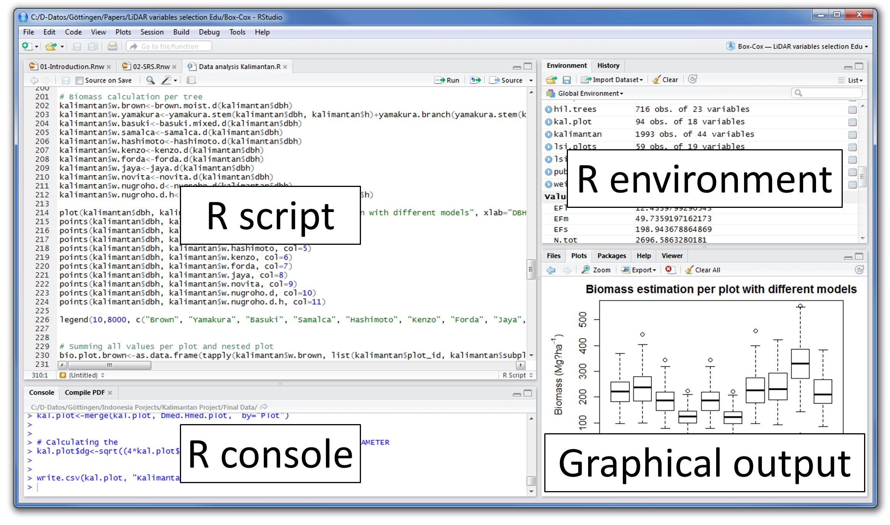
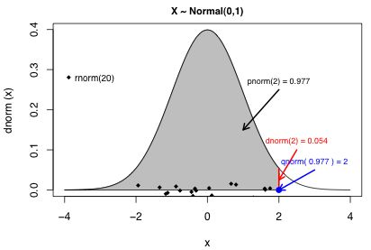

# Introduction
## What are we doing here?
This is a (brief and fairly general) introduction to data analysis in R. The goals are to introduce you to: 

- how to use R to analyze data statistically
- how to visualize data in R

It is **not** intended to be any sort of substitute for a real stats class.

# Preliminaries

## Why R?
Unlike other sections of this bootcamp, the stats portion will introduce you to R. Why are we doing this to you? Are we mean? Do we hate consistency?

----

There are a few reasons to do this portion in R, and for you to learn R alongside Python:

- **Practicality**. Having Python on your resume looks good; having both R and Python looks great.
- **Interdisciplinarity**. While STEM fields have generally used Python for scientific computing, the social sciences have typically used Stata or R. Stata sucks, so R it is.
- **Data cleaning**. The computational side of statistical analysis is often simple; the tricky part is cleaning and organizing your data to play nice with the statistical model.
- **Visualization**. While matplotlib 2.0 no longer has eye-bleeding defaults, it's often easier to create publication-quality visualizations in R.
- **Libraries**. Bleeding-edge developments in statistical modeling often come with R packages instead of Python libraries. 

## Libraries
We touched on libraries (hopefully) in the on-boarding session, but here are a few libraries that will be helpful:

- **ggplot2**, the go-to visualization library.
- **dplyr** and **tidyr**, which make data cleaning much easier.
- **readr** and **haven** for loading data files.

All of these packages are part of the so-called [Tidyverse](https://www.tidyverse.org/) and I recommend simply installing the **tidyverse** meta-package, which makes loading the core packages more convenient and provides a convenient interface for keeping these packages up-to-date.

Another useful library is **devtools**, which provides functionality for installing packages from Github. We won't do any of that today, but it's good to have.

----

```{r}
# install.packages(c("tidyverse", "devtools"))
# devtools::install_github("tidyverse/tidyverse")
```

```{r, message=F}
library(tidyverse)
# tidyverse_update()
```

# What is R and how do I do stuff with it?
## History

Despite only really coming into vogue in the late 2000s/early 2010s, R has been around for a while. It was first proposed in 1992 and was stable in 2000. R itself is an open-source implementation of S, a much older language. The history's not terribly interesting, but does help explain some of the occasionally confusing aspects of the language (especially its bizarre class sytem). 

Like Python, R is intepreted, so you can open an interpreter (like the Python REPL) from your command line by calling R. Also like Python, it can be used as a scripting language. More portable formats like **[knitr](https://yihui.name/knitr/)** and **[RMarkdown](http://rmarkdown.rstudio.com/)** have grown in popularity as part of trend toward reproducible research. (These slides are in RMarkdown.)

## RStudio

In general, people prefer supplementing "vanilla" R with RStudio, which is the go-to IDE for working in R. 

You're free to use other environments (emacs works well with R), but I don't recommend it.

----

```{r, out.width = "800px", echo=F}

```

(image taken from [here](http://wiki.awf.forst.uni-goettingen.de/wiki/index.php/Installation_and_Interface_of_R) )

## Let's get this part over with

One of the most striking things when looking at R is its assignment operator:


```{r}
x <- 1 # dumb but preferred
y = 2  # smart but don't do it

print(x + y)
```

The bizarre "<-" operator is the [preferred](http://style.tidyverse.org/syntax.html#assignment) assignment operator in R. I don't particularly like it, and I can't make you use it, but at the very least try to be consistent in the use of "<-" and "=". 

(To make things worse, they actually have [slightly different behaviors](https://stackoverflow.com/questions/2271575/whats-the-difference-between-and-in-r), so definitely be consistent!)

# Types and Data Structures

## Vectors

R has a somewhat unusual type system and this is usually the first stumbling block. The basic element in R is the vector and virtually all base operations in R are vectorized.

```{r, results='hold'}
typeof(1)
typeof(c(1, 2)) # c(), the concentate function is usually 
                # the most convenient way to create a vector
is.vector(1)    # even scalars are vectors!
is.vector(c(1, 2))
blank_vec <- vector()
length(blank_vec)
```

----

```{r, results='hold'}
1 + c(2, 3)
vec <- c(1, 2) + c(2, 3)
vec
length(vec)
vec + c(3, 3, 4, 4) # what's happening here?
```

## Atomic vectors

To be specific, these are *atomic vectors* and all elements must be of the same type. The possible types are:
```{r, results='hold'}
typeof(c(TRUE, FALSE))
typeof(c(1, 2, 3))
typeof(c(1L, 2L, as.integer(3)))
typeof(c(1+0i, 2+3i))
typeof(c("1", "2", "3"))
```

## Coercion

If there are multiple types in a vector, they are coerced to the most general type to appear. The ranking is:
character (most general) > complex > double > logical > integer (least general).

```{r, results='hold'}
typeof(c(1+2i, TRUE))
typeof(c(2, "a"))
typeof(c(2L, 2))
```

## NaN, NA, and NULL

I've overlooked a few subtleties here but this will cover most types you will encounter. One possible exception - there is a NULL type that can cause problems:

```{r, results='hold'}
typeof(NaN)  # NaN is numeric,
typeof(NA)   # NA is logical,
typeof(NULL) # but NULL is its own thing.
```

## Lists

Aside from atomic vectors, there is a generic vector type called a *list*. (Nearly everything in R is either a function or a vector, and many familiar data structures in R are actually just non-atomic vectors.) Lists are more generic than (atomic) vectors; they can hold multiple types, including themselves. 

Lists can have named attributes that are accessed using the $ operator.

----

```{r}
l <- list(1, "a", vec, c(1+2i, 2+4i), x=list(1))
l
```

## Special cases (1): Matrices
There are two very important special cases. A *matrix* is a numeric vector that also has dimensionality. 
```{r, results='hold'}
mat <- matrix(c(1, 2, 3, 4), nrow=2, ncol=2)
mat
typeof(mat)
is.matrix(mat)
is.vector(mat)
dim(mat)
```

## Special cases (2): Data frames
A *data frame* is a list where all columns are of equal length.
```{r, results='hold'}
df <- data.frame(list(num=c(1, 2, 3),
                  str=c("a", "b", "c"),
                  log=c(TRUE, T, FALSE)),
                 stringsAsFactors = FALSE)
df
```

The data frame (or its tidyverse extension, the tibble) is the key data structure for working with real-world data sets, as we'll see later.

## str()

For exploring the types of a data frame's columns, the str() function is helpful:
```{r}
str(df) 
# What are factors? We'll talk about them later,
# but for now think of them as enums.
```

## Exercises

```{r, eval=F, results='hide'}
# What are the types of the following vectors?
typeof(c(1, 2L, 2+1i))
typeof(c(TRUE, T))
typeof(c("TRUE", 1, 0))

# what's wrong with the following command?
df = data.frame(list(num=c(1,2,3),
                    more_nums=c(2,3)))
```

## Solutions

```{r, error=TRUE, results='hold', width=80, tidy=T}
# What are the types of the following vectors?
typeof(c(1, 2L, 2+1i))
typeof(c(TRUE, T))
typeof(c("TRUE", 1, 0))

# what's wrong with the following command?
df = data.frame(list(num=c(1,2,3),
                    more_nums=c(2,3)))
```


## Functions
The last major type is function (or closure). Functions are first-class citizens in R. 

Function creation takes the following form:

```{r, results='hold'}
is_odd <- function(x) { 
  x %% 2 == 1 # note that the modulo operator is %%, not %!
  # note that there is no explicit return
  }

typeof(is_odd)
```

----

Once created, calling a function is fairly straightforward.
```{r, results='hold'}
is_odd(0)
is_odd(1)
# remember: pretty much everything in R is vectorized
is_odd(c(0, 1, 2, 3)) 
```

This is a really brief introduction to functions that leaves out a ton. If you want or need to learn more about functions, check out [this link](http://adv-r.had.co.nz/Functions.html).

## Anonymous functions

An aside: like in Python, there are anonymous functions, but compared to Python I find myself using them less frequently.
```{r}
(function(x) x + 1)(2) # in this syntax the braces are optional
```

## Indexing vectors
In big bold letters:

**R INDEXES START AT 1, NOT 0. THIS IS NOT LIKE PYTHON.** 

```{r, results='hold'}
vec <- c(3, 4, 5, 6, 7, 8)
# Alternate syntax: use : for ranges. 
# Note that 3:8 is [3, 8], not [3, 8).
vec <- c(3:8) 
vec[1]
vec[2]
vec[0] # doesn't do what you want
```

## Subsetting vectors

A vector can be subsetted by another vector, typically a logical vector or a vector of integer indices.
```{r, results='hold'}
vec[1:3]
vec[c(T, T, F, T, F, T)]

vec[is_odd(vec)]
```

## List indexing

List indexing is slightly different from vector indexing. Because the elements of a list are also represented as lists, using single-bracket indexing also returns a list. This is typically not what you want, and has some odd implications. 

To access an element more directly, use double-bracket syntax.

----
```{r, results='hold'}
l
```

----

```{r, results='hold'}
l[1]
l[1][1][1][1][1][1][1][1][1][1][1][1][1][1][1]
l[[1]]
```


## The $ operator

Named elements of lists (attributes) have their own syntax, the soon-to-be-ubiquitous $ operator.
```{r, results='hold'}
l[[5]]
l$x
l$x[[1]]
```

## Indexing data frames

Data frames are a bit easier to work with than generic lists, but have their own subtleties. Data frame columns are almost always named, so the $ operator does a lot of work:
```{r, results='hold'}
df
```

## Indexing data frames

```{r, results='hold'}
df$num
df[1]
df[[1]]
```

## Subsetting data frames

Depending on the goal, it can be useful to subset both data frame rows (observations) and columns (features).
```{r, results='hold'}
df[1,] # row
df[, 2] # column
df[1, 2] # the second feature of the first observation
df[c(1, 2), c(2, 3)] # you can even do vectors here but don't
```
For large transformations of data frames, there are usually better approaches, which we'll get to later.

## Exercises

```{r, eval = F}
numbers = 1:1000
# Generate a vector of the square numbers between 1 and 1000
# using vector subsetting.
```

## Solutions

```{r}
numbers = 1:1000
# using an anonymous function
numbers[(function (x) sqrt(x) %% 1 == 0)(numbers)]

# this way is more common
is_square <- function(x) {
  sqrt(x) %% 1 == 0
}
numbers[is_square(numbers)]
```

## Anscombe's quartet

We can use some toy data to do summary statistics, exploratory visualization, etc.
```{r}
# from the (hopefully automatically loaded) datasets package
df = tbl_df(anscombe) 
head(df)
```

## Univariate statistics

The usual univariate statistics functions are implemented and behave as expected:
```{r, results='hold'}
mean(df$y1)
median(df$y2)
sd(df$y3)
range(df$y4)
```

## Summarizing data

The summary() function provides a useful interface to some of the univariate statistics.
```{r, results='hold'}
summary(df$y1)
head(summary(df))[,5:8]
```

## Bivariate relationships

Bivariate statistics are also implemented.

```{r, results='hold'}
cor(df$x1, df$y1)
cov(df$x2, df$y2)
```

## Distributions and hypothesis testing

R implements many of the common statistical distributions you will encounter. (Notable exceptions include the multivariate normal, which is implemented in a few different libraries, and the power law distribution, which is implemented in poweRlaw). All of these distributions take a similar form: four functions differentiated by a letter prefix:

- **r**, for generating **random** variates
- **p**, for the **probability** function (the CDF)
- **d**. for the probability **density** function (the PDF)
- **q**, for the **quantile** function (the inverse CDF)

So to generate normally-distributed numbers, you would call rnorm(), for the density of a Poisson distribution you would call dpois(), etc. etc.

----

I have a hard time remembering which does which, so here's a useful graphic to visualize the different functions:
```{r, out.width='600px', echo=F}

```

(Image from [here](https://www.unc.edu/courses/2008fall/ecol/563/001/docs/lectures/lecture3.htm))

----

It's commonly assumed that heights are normally distributed. In fact, the Internet (which is never wrong) tells me that American women's heights are normally distributed with mean 63.6 inches and standard deviation 2.5 inches. 
```{r}
hist(rnorm(1000, 63.6, 2.5), breaks=50:80)
```


As it turns out, heights are [*not* normally distributed](http://wagesofwins.com/2013/04/10/could-brittney-griner-make-it-in-the-nba/): there's more extreme values than would be predicted by a normal distribution. To give an example, Elena Della Donne of the Washington Mystics (WNBA team) is 77 inches tall. 

```{r, results='hold'}
pnorm(77, mean=63.6, sd=2.5)
qnorm(.99999996, mean=63.6, sd=2.5)
```
This means that she should be in the 99.999996th percentile of the height distribution; she should be a singular entity. However, there are a few other WNBA players her height and the tallest women is a whole foot taller than her! Always be careful with modeling assumptions.

# Exploratory data visualization

## "Base R" plotting
For simple tasks like a histogram or scatterplot, the default plotting capabilities in R are usually sufficient.

```{r}
hist(df$y3)
```

----

```{r}
hist(df$y3, breaks=floor(min(df$y3)):ceiling(max(df$y3)))
```

----

```{r}
plot(df$x1, df$y1, xlab="X", ylab="Y", main="Anscombe's Quartet")
points(df$x2, df$y2, col="red")
points(df$x3, df$y3, pch=3)
points(df$x4, df$y4, col="blue")
```

## "Base R" plotting

This can be made cleaner by using some of R's (somewhat obscure) graphical parameters.
```{r, eval=F}
par(mfrow=c(2, 2))
plot(df$x1, df$y1, xlab="X", ylab="Y", main="Anscombe's Quartet (1)")
plot(df$x2, df$y2, xlab="X", ylab="Y", main="Anscombe's Quartet (2)")
plot(df$x3, df$y3, xlab="X", ylab="Y", main="Anscombe's Quartet (3)")
plot(df$x4, df$y4, xlab="X", ylab="Y", main="Anscombe's Quartet (4)")
```

----

```{r, echo=F}
par(mfrow=c(2, 2))
plot(df$x1, df$y1, xlab="X", ylab="Y", main="Anscombe's Quartet (1)")
plot(df$x2, df$y2, xlab="X", ylab="Y", main="Anscombe's Quartet (2)")
plot(df$x3, df$y3, xlab="X", ylab="Y", main="Anscombe's Quartet (3)")
plot(df$x4, df$y4, xlab="X", ylab="Y", main="Anscombe's Quartet (4)")
```

## ggplot

It's not always appropriate for quick-and-dirty plotting (for example, you can't simply pass it vectors), but ggplot can do these sorts of exploratory visualizations too.
```{r, eval=F}
ggplot(df, aes(x=y3)) + geom_histogram(binwidth = 1)
```

----

```{r, echo=F}
ggplot(df, aes(x=y3)) + geom_histogram(binwidth = 1)
```

----

At first, ggplot's design can seem hopelessly arcane, but you get used to it quickly. Basically, each call to ggplot has to have three elements:

- The **data** you're plotting. This must be a data frame.
- An **aesthetic mapping** indicating which columns map to which axes, and how to subdivide the data if necessary.
- A **geometry** indicating the how to plot the data (e.g. scatter plot, bar graph, etc.)

----

```{r, eval=F}
ggplot(df) + 
  geom_point(aes(x = x1, y = y1, color="1")) + 
  geom_point(aes(x = x2, y = y2, color="2")) + 
  geom_point(aes(x = x3 ,y = y3, color="3")) + 
  geom_point(aes(x = x4, y = y4, color="4")) + 
  scale_color_discrete() +
  labs(title = "Anscombe's Quartet", x = "X", y = "Y", 
       color = "Legend")
```

(Note that this repetition is because our data is in a format that ggplot doesn't love; we'll see how this could be done more cleanly later.)

----

```{r, echo=F}
ggplot(df) + 
  geom_point(aes(x = x1, y = y1, color="1")) + 
  geom_point(aes(x = x2, y = y2, color="2")) + 
  geom_point(aes(x = x3 ,y = y3, color="3")) + 
  geom_point(aes(x = x4, y = y4, color="4")) + 
  scale_color_discrete() +
  labs(title = "Anscombe's Quartet", x = "X", y = "Y", color = "Legend")
```

## ggplots + gridExtra

Multiple plots is not quite as easy in ggplot. There are a few ways to do it, but I typically use the gridExtra package.

```{r, eval=F}
library(gridExtra)
p1 <- ggplot(df, aes(x=x1, y=y1)) + geom_point()
p2 <- ggplot(df, aes(x=x2, y=y2)) + geom_point()
p3 <- ggplot(df, aes(x=x3, y=y3)) + geom_point()
p4 <- ggplot(df, aes(x=x4, y=y4)) + geom_point()
grid.arrange(p1, p2, p3, p4)
```

----

```{r, echo=F, message=F}
library(gridExtra)
p1 <- ggplot(df, aes(x=x1, y=y1)) + geom_point()
p2 <- ggplot(df, aes(x=x2, y=y2)) + geom_point()
p3 <- ggplot(df, aes(x=x3, y=y3)) + geom_point()
p4 <- ggplot(df, aes(x=x4, y=y4)) + geom_point()
grid.arrange(p1, p2, p3, p4)
```

Remember: where possible, always visualize your data.

# Linear regression the easy way and the hard way

## Getting some data

The Wikipedia page for linear regression has a nice toy example, so let's steal it.
```{r}
hw_data <- tibble(
  height = c(1.47, 1.50, 1.52, 1.55, 1.57, 1.60, 1.63,	
             1.65, 1.68, 1.70, 1.73, 1.75, 1.78, 1.80, 1.83),
  weight = c(52.21, 53.12, 54.48, 55.84, 57.20, 58.57,	
             59.93, 61.29, 63.11, 64.47, 66.28, 68.10,	
             69.92, 72.19, 74.46))
```
We theorize that there's some sort of relationship between height and weight. Maybe it's linear? Let's start by visualizing our data.

----

```{r, fig.height=3.5}
ggplot(hw_data, aes(x = height, y = weight)) + geom_point()
```

The relationship's close to linear, but since there's a bit of a curve, let's add a squared term to try to capture this nonlinearity.

```{r}
hw_data$height_square <- hw_data$height^2
```

## The hard way

At the end of the day, OLS regression is just matrix algebra, so we can do this without relying on any fancy functions. This also lets us see how to use matrices in R.
```{r}
y  <- hw_data$weight
x0 <- rep(1,15) # We need a one-vector for estimating the intercept
x1 <- hw_data$height
x2 <- hw_data$height_square
X  <- matrix(c(x0,x1,x2), nrow=15, ncol=3)
```

We can estimate the coefficients of the linear model using
$$
\hat{\beta} = (X^TX)^{-1}X^Ty.
$$

----

This is not too hard to do in R (note that t() is the transpose function, %*% is the operator for matrix multiplication, and solve() inverts a square matrix).
```{r}
betas <- solve(t(X) %*% X) %*% t(X) %*% y
betas
```

----

From this we can get the fitted values
$$
\hat{y} = X\hat{\beta}
$$
and the residuals
$$\hat{\varepsilon} = y-\hat{y}.$$

```{r}
fitted    <- X %*% betas 
residuals <- y - fitted
```


The residuals are necessary to get the standard error:
```{r}
s2 <- (residuals%*%t(residuals))/(dim(X)[1] - dim(X)[2])
```
**(If this line is still here I forgot to finish this train of thought!)**

## The easy way

That takes too much effort, especially for such a simple regression.

```{r, eval=c(1:4)}
model <- lm(weight ~ height + height_square, data = hw_data)
# this would do the same thing
# model <-lm(weight ~ height + I(height^2), data = hw_data) 
model
summary(model)
```

----

```{r, echo=F}
summary(model)
```

Much easier, and the output is cleaner too. Note that the model object is just a complicated list, and many of its attributes can be accessed directly:

```{r}
model$coefficients
```

----

Finally, let's plot our regression line against the data.
```{r, fig.height=3}
ggplot(hw_data, aes(x=height, y=weight)) + 
  geom_smooth(method="lm",  formula = y ~ x+ I(x^2)) + 
  geom_point() 
```

Pretty good!


## Exercise

I jumped straight to the model with the quadratic term to justify using matrices, but what about the simple linear model? Fit both the linear and quadratic models.

Which works better, and why? Plot each against the data.

## Solution

```{r, results="hold"}
model <- lm(weight ~ height + height_square, data = hw_data)
linear_model <- lm(weight ~ height, data = hw_data)
summary(model)$r.squared
summary(linear_model)$r.squared
AIC(model)
AIC(linear_model)
```

----

```{r,eval=F}
ggplot(hw_data, aes(x=height, y=weight)) + 
  theme_minimal() + 
  geom_smooth(method="lm", color="blue") + 
  geom_smooth(method="lm",  formula = y ~ x + I(x^2), color = "red") + 
  geom_point() +
  annotate("text", label="Two-term nonlinear model", 
           color="red", x =1.65, y = 57) +
  annotate("text", label="Single-term linear model", 
           color="blue", x = 1.58, y = 53) +
  labs(x="Height (m)", y="Weight (kg)", 
       title="Relationship between height and weight (1975)")
```

----

```{r, echo=F}
ggplot(hw_data, aes(x=height, y=weight)) + 
  theme_minimal() + 
  geom_smooth(method="lm", color="blue") + 
  geom_smooth(method="lm",  formula = y ~ x + I(x^2), color = "red") + 
  geom_point() +
  annotate("text", label="Two-term nonlinear model", 
           color="red", x =1.65, y = 57) +
  annotate("text", label="Single-term linear model", 
           color="blue", x = 1.58, y = 53) +
  labs(x="Height (m)", y="Weight (kg)", 
       title="Relationship between height and weight (1975)")
```

# Data cleaning in the tidyverse

## What is tidy data and why should I care?
**Tidy data** is a ~~cult~~ approach to organizing data for efficiency and reproducibility. It's a good idea in general, and for some purposes in R it's near-mandatory, especially when trying to do very complicated visualizations in ggplot. 

In tidy data:

1. Each variable forms a column.
2. Each observation forms a row.
3. Each type of observational unit forms a table.

(this definition, and the following example, are both from [Wickham (2014)](http://vita.had.co.nz/papers/tidy-data.pdf))

## An example

|              | treatmenta | treamentb |
|--------------|------------|-----------|
|  John Smith  | -          | 2         |
| Jane Doe     | 16         | 11        |
| Mary Johnson | 3          | 1         |
 
 Another way of representing the same dataset:


|            | John Smith | Jane Doe | Mary Johnson |
|------------|------------|----------|--------------|
| treatmenta | -          | 16       | 3            |
| treamentb  | 2          | 11       | 1            |

## The tidy way

| name         | trt | result |
|--------------|-----|--------|
| John Smith   | a   | -      |
| Jane Doe     | a   | 16     |
| Mary Johnson | a   | 3      |
| John Smith   | b   | 2      |
| Jane Doe     | b   | 11     |
| Mary Johnson | b   | 1      |

## The tidyr way
Let's take our original table:
```{r}
untidy_data <- tibble(name=c("John Smith", 
                             "Jane Doe", 
                             "Mary Johnson"),
                      treatmenta=c(NA,16,3), 
                      treatmentb=c(2,11,1))
untidy_data
```

----
Now let's make it tidy.
```{r}
tidy_data <- gather(untidy_data, "trt", "result", 2:3)
tidy_data
```

## The tidyr way: Anscombe's quartet

I mentioned before that the Anscombe data wasn't in quite the right format. Let's tidy it up.
```{r}
# an example of a complicated transformation
# ask yourself: what does my data look like at each step of the transformation?
tidy_anscombe <- anscombe %>% 
  mutate(point=seq_along(anscombe$x1)) %>%
  gather(key, value, -point) %>%
  separate(key, c("var", "set"), 1, convert = T) %>%
  spread(var, value)
head(tidy_anscombe)
```

## Factors

```{r}
tidy_anscombe$set <- factor(tidy_anscombe$set,
                            levels = 1:4,
                            labels=c("First Quartet",
                                     "Second Quartet",
                                     "Third Quartet",
                                     "Fourth Quartet"))
head(tidy_anscombe)
```

## Tidy data in ggplot

```{r}
ggplot(tidy_anscombe, aes(x=x, y=y, color=set)) + 
  geom_point() +
  scale_color_discrete()
```


# Resources

## Cheat sheets
The RStudio website has some terrific cheat sheets that I encourage everyone to bookmark (especially the data wrangling one, which I have to reference every time I use tidyr):

- [Base R](https://github.com/rstudio/cheatsheets/blob/master/source/pdfs/base-r.pdf)
- [ggplot2](https://github.com/rstudio/cheatsheets/blob/master/source/pdfs/ggplot2-cheatsheet-2.1.pdf)
- [RMarkdown](https://github.com/rstudio/cheatsheets/blob/master/source/pdfs/rmarkdown-cheatsheet-2.0.pdf)
- [RStudio IDE](https://github.com/rstudio/cheatsheets/blob/master/source/pdfs/rstudio-IDE-cheatsheet.pdf)
- [Data Wrangling](https://github.com/rstudio/cheatsheets/blob/master/source/pdfs/data-wrangling-cheatsheet.pdf)
- [Data Transformation](https://github.com/rstudio/cheatsheets/blob/master/source/pdfs/data-transformation-cheatsheet.pdf)

## Working in R
If you're doing large-scale work in R, especially involving package development, here are some useful sources on development and R internals:
- The companion website to Wickham's [Advanced R](http://adv-r.had.co.nz/) book.
- "                                " [R Packages](http://r-pkgs.had.co.nz/) "  ".


## Workflow
Some good resources on structuring and approaching a data analysis project:

- [Wilson et al (2017) - Good enough practices in scientific computing](http://journals.plos.org/ploscompbiol/article?id=10.1371/journal.pcbi.1005510)
- [Wickham (2014) - Tidy data](http://vita.had.co.nz/papers/tidy-data.pdf)
- [Leek (2015) - The elements of data analytic style](https://leanpub.com/datastyle)
- [The tidyverse style guide](http://style.tidyverse.org/index.html)

## Networks in R
Katya Ognyanova, one of David's former postdocs, has a good [introduction to network analysis in R](http://kateto.net/networks-r-igraph) with igraph. 


